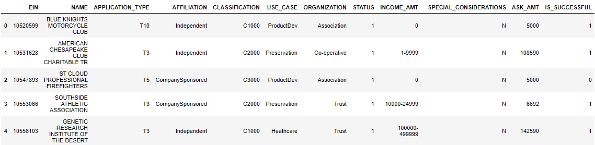
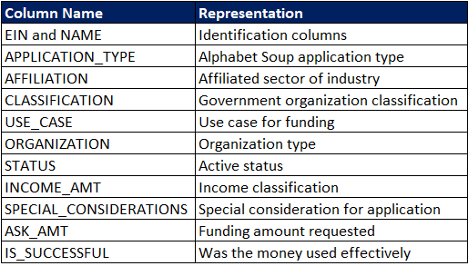
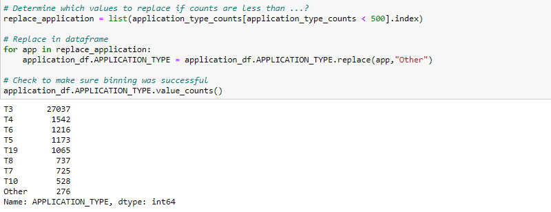
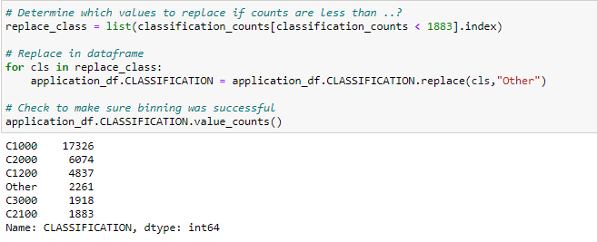
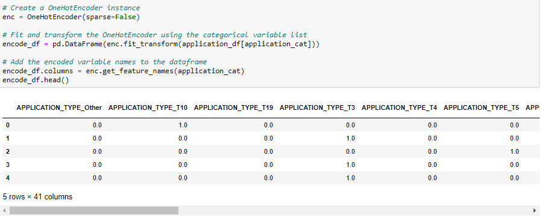
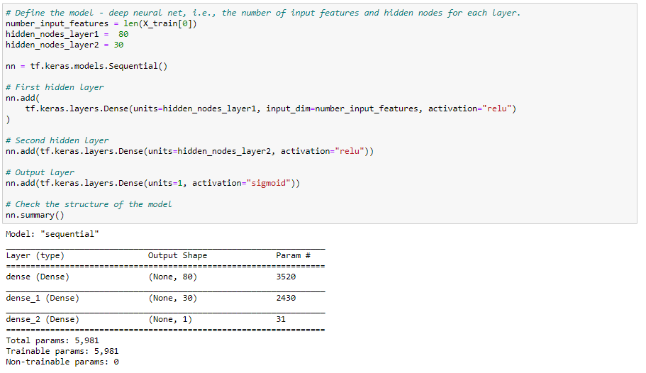
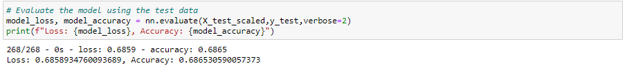
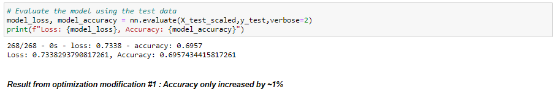
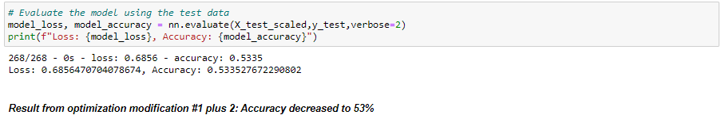
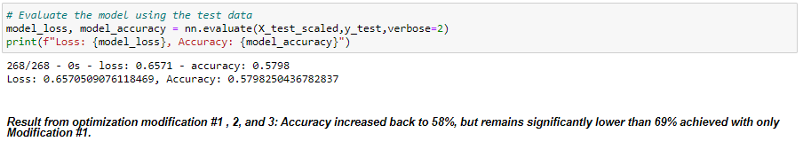

# DABC-Neural_Network_Charity_Analysis

## Overview

The purpose of this repository is to utilize deep learning Neural Networks to make binary predictions of whether or not a donation would be successful. 

## Results:

Below screenshot presents the first 5 rows of raw data that the model would be using after a few preprocessing is performed on the data.
</img>

Below screenshot shows the metadata.

</img>

### Data Preprocessing:

- Since our model is designed to make binary predictions of whether or not a donation would be successful, the "IS_SUCCESSFUL" column is our target variable.

- Identiification columns (EIN and NAME) are neither targets nor features, and should be removed from the input data since they do not provide any value in training and predicting whether or not a donation would be successful. Logically, a donation's success or failure should depend on factors other than the name and ID of the organization.

- The remaining columns are features considered for the model, which include: APPLICATION_TYPE, AFFILIATION, CLASSIFICATION, USE_CASE, ORGANIZATION, STATUS, INCOME_AMT, SPECIAL_CONSIDERATION, and ASK_AMT

- Further preprocessing was performed on the feature columns: APPLICATION_TYPE and CLASSIFICATION were binned and all categorigcal features were encoded into nummerical values by using OneHotEncoder, as shown in below screenshots.

</img>

</img>

</img>

### Compiling, Training, and Evaluating the Model:

- Once the data has been preprocessed, the neural netowrk model is ready to be compiled and trained. Two hidden layers were used for this model, ending with an output layer with one node to predict successful/not successful. The first hidden layer has 80 neurons, which is based on the standard rule-of-thumb practice to use 2 to 3 times of input features on the first layer. A 2nd layer was included to expand the model's capacity to handle the complexity of the input data, which has 43 input features. Both layers were using the "ReLu" activiation function as the model is using positive non-linear input data for classification.

</img>

- With the above specifications, the model was able to achieve a 68.6% accuracy, which is lower than the target of 75% accruacy.

</img>

- Attempts were made to improve the accuracy of the model, including (1) Increasing the number of neurons on the first layer to 120, (2) adding a 3rd hidden layer with 10 neurons, and (3) increasing the number of epochs from 100 to 200. However, as shown in below screenshots, the optimization attempts were not successful. Only modification (1) was able to increase the accuracy by ~1%.

</img>

</img>

</img>

### Summary:

Overall, the highest achievable accuracy from the deep learning model appears to be limited at ~70%. Besides the above mentioned modifications, attempts were made to remove certain features deemed unnecessary (e.g. STATUS, SPECIAL_CONSIDERATION), changing the number neurons in each layer, and changing the activation used on each layer. However, the model's accuracy did not improve. However, a deep learning Neural Netowrk model is not the only option on the table. We could also use a Random Forest Machine Learning Model to perform this classification. By combining a number of weak learner decision trees to come to a concensus classification, Random Forest is able to produce robust and accurate results. Since input data is tabular, Random Forest is an ideal alternative model to use.

